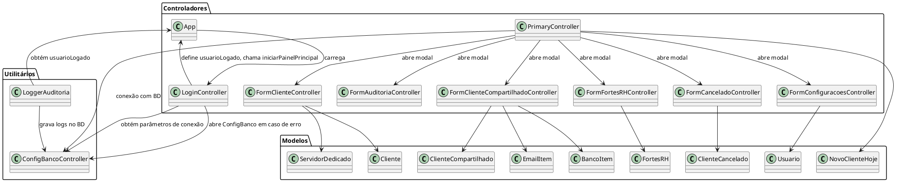

# Proton — Gestão de Infraestrutura

> Sistema corporativo para gerenciamento de clientes de infraestrutura de TI.  
> Desenvolvido em **JavaFX + PostgreSQL**.

   

---

## Sumário

- [Funcionalidades](#funcionalidades)
- [Arquitetura](#arquitetura)
- [Tecnologias](#tecnologias)
- [Estrutura do Projeto](#estrutura-do-projeto)
- [Configuração do Ambiente](#configuração-do-ambiente)
- [Como Executar](#como-executar)
- [Backup e Restauração](#backup-e-restauração)
- [Mapa de Interligações (UML)](#mapa-de-interligações-uml)
- [Contribuição](#contribuição)
- [Licença](#licença)

---

## Funcionalidades

- Login seguro com troca de senha no primeiro acesso
- Painel principal (Dashboard) com gráficos e indicadores
- CRUD completo para:
  - Clientes Dedicados (com gestão de servidores)
  - Clientes Compartilhados (com e-mails e bancos associados)
  - Ambientes Fortes RH (Compartilhado e Dedicado)
  - Histórico de Cancelamentos
- Auditoria completa (arquivo local + banco de dados)
- Gestão de usuários com níveis de acesso (`TECNICO`, `N2`, `MASTER`)
- Configuração dinâmica do banco de dados (salva em arquivo `.properties`)
- Backup do banco via `pg_dump` (somente usuários `MASTER`)
- Pesquisa e filtro em tempo real nas tabelas
- Notificações toast para ações realizadas

---

## Arquitetura

O sistema segue o padrão **MVC** adaptado ao JavaFX:

| Camada | Implementação | Responsabilidade |
|--------|---------------|------------------|
| **View** | Arquivos `.fxml` | Definição declarativa das telas |
| **Controller** | Classes `*Controller.java` | Gerenciam eventos e lógica das telas |
| **Model** | POJOs (`Cliente`, `FortesRH`, etc.) | Representam as entidades do domínio |
| **Utilitários** | `ConfigBancoController`, `LoggerAuditoria` | Conexão, configuração e auditoria |

### Interdependências principais

| Classe | Depende de | Função |
|--------|------------|--------|
| `App` | `LoginController` | Gerencia a janela principal e a sessão |
| `LoginController` | `App`, `ConfigBancoController` | Autentica e inicia o dashboard |
| `PrimaryController` | `App`, `ConfigBancoController`, todos os forms | Dashboard e navegação entre abas |
| `FormClienteController` | `Cliente`, `ServidorDedicado`, `ConfigBancoController` | CRUD de clientes dedicados |
| `FormClienteCompartilhadoController` | `ClienteCompartilhado`, `EmailItem`, `BancoItem` | CRUD de clientes compartilhados |
| `FormFortesRHController` | `FortesRH`, `ConfigBancoController` | CRUD de ambientes Fortes RH |
| `FormCanceladoController` | `ClienteCancelado`, `ConfigBancoController` | CRUD de cancelamentos |
| `FormConfiguracoesController` | `App`, `ConfigBancoController` | Administração de usuários e backup |
| `FormAuditoriaController` | `ConfigBancoController` | Exibição dos logs de auditoria |
| `LoggerAuditoria` | `App`, `ConfigBancoController` | Grava logs em arquivo e no banco |
| `ConfigBancoController` | `config_banco.properties` | Fornece parâmetros de conexão |

---

## Tecnologias

| Tecnologia | Uso |
|------------|-----|
| **Java 8+** | Linguagem principal |
| **JavaFX** | Interface gráfica |
| **PostgreSQL** | Banco de dados |
| **JDBC** | Conexão nativa com o banco |
| **pg_dump** | Backup do banco |
| **FXML** | Definição declarativa das telas |
| **SceneBuilder** *(opcional)* | Editor visual de FXML |
| **PlantUML** | Geração de diagramas UML |

---

## Estrutura do Projeto

```
proton/
├── src/
│   └── main/
│       └── java/
│           └── com/
│               └── mycompany/
│                   └── proton/
│                       ├── App.java
│                       ├── LoginController.java
│                       ├── PrimaryController.java
│                       ├── FormClienteController.java
│                       ├── FormClienteCompartilhadoController.java
│                       ├── FormFortesRHController.java
│                       ├── FormCanceladoController.java
│                       ├── FormConfiguracoesController.java
│                       ├── FormAuditoriaController.java
│                       ├── ConfigBancoController.java
│                       ├── LoggerAuditoria.java
│                       ├── Cliente.java
│                       ├── ClienteCompartilhado.java
│                       ├── FortesRH.java
│                       ├── ClienteCancelado.java
│                       ├── ServidorDedicado.java
│                       └── (EmailItem, BancoItem, Usuario, NovoClienteHoje)
├── config_banco.properties     # Configuração do banco (gerado automaticamente)
├── auditoria_proton.log        # Logs de auditoria local
├── backup_proton_*.sql         # Backups gerados pelo sistema
└── README.md
```

---

## Configuração do Ambiente

### 1. Banco de dados

Execute os scripts abaixo para criar as tabelas necessárias:

```sql
-- Usuários do sistema
CREATE TABLE usuarios_sistema (
    id SERIAL PRIMARY KEY,
    email VARCHAR(255) UNIQUE NOT NULL,
    senha VARCHAR(255) NOT NULL DEFAULT 'fortes123',
    nivel_acesso VARCHAR(20) DEFAULT 'TECNICO',
    status VARCHAR(20) DEFAULT 'ATIVO'
);

-- Clientes dedicados
CREATE TABLE clientes_dedicados (
    id SERIAL PRIMARY KEY,
    cliente VARCHAR(255),
    cnpj_cpf VARCHAR(30),
    qnt_de_servs INTEGER,
    ad VARCHAR(255),
    ambiente VARCHAR(50),
    vpn BOOLEAN DEFAULT FALSE,
    criado_por VARCHAR(255),
    data_criacao DATE DEFAULT CURRENT_DATE,
    hora_criacao TIME DEFAULT CURRENT_TIME
);

-- Servidores dos clientes dedicados
CREATE TABLE servidores_clientes_dedicados (
    id SERIAL PRIMARY KEY,
    cliente_id INTEGER REFERENCES clientes_dedicados(id),
    tipo_servidor VARCHAR(100),
    ip_servidor VARCHAR(100),
    usuario VARCHAR(100),
    senha VARCHAR(100)
);

-- Clientes compartilhados
CREATE TABLE clientes_compartilhados (
    id SERIAL PRIMARY KEY,
    tipo_nuvem VARCHAR(50),
    pod INTEGER,
    data_criacao DATE DEFAULT CURRENT_DATE,
    hora_criacao TIME DEFAULT CURRENT_TIME,
    razao_social VARCHAR(255),
    cpf_cnpj VARCHAR(30),
    razao_cnpj_antigos VARCHAR(255),
    cod_ag VARCHAR(50),
    pasta_rede VARCHAR(255),
    contato VARCHAR(255),
    usuarios INTEGER,
    origem VARCHAR(100),
    telefone VARCHAR(50),
    email VARCHAR(255),
    sistemas VARCHAR(255),
    status VARCHAR(50),
    banco VARCHAR(100),
    criado_por VARCHAR(255)
);

-- Bancos de dados dos clientes compartilhados
CREATE TABLE bancos_nuvem_compartilhada (
    id SERIAL PRIMARY KEY,
    id_cliente INTEGER REFERENCES clientes_compartilhados(id),
    segmento VARCHAR(100),
    razao_social VARCHAR(255),
    ip_servidor VARCHAR(100),
    nome_banco VARCHAR(100),
    caminho_conexao VARCHAR(255),
    caminho_banco VARCHAR(255),
    sgbd VARCHAR(50),
    usuario_banco VARCHAR(100),
    senha_banco VARCHAR(100)
);

-- Usuários dos clientes compartilhados
CREATE TABLE usuarios_nuvem_compartilhada (
    id SERIAL PRIMARY KEY,
    id_cliente INTEGER REFERENCES clientes_compartilhados(id),
    email_usuario VARCHAR(255)
);

-- Ambientes Fortes RH
CREATE TABLE fortesrh (
    id SERIAL PRIMARY KEY,
    tipo_ambiente VARCHAR(50),
    cliente VARCHAR(255),
    cnpj_cpf VARCHAR(30),
    url_acesso VARCHAR(255),
    servidor_app VARCHAR(255),
    banco_dados VARCHAR(255),
    pasta_web VARCHAR(255),
    usuario_db VARCHAR(100),
    senha_db VARCHAR(100),
    load_balance VARCHAR(50),
    ip_load_balance VARCHAR(100),
    status VARCHAR(50),
    data_criacao DATE DEFAULT CURRENT_DATE,
    hora_criacao TIME DEFAULT CURRENT_TIME,
    ip_publico VARCHAR(100),
    ip_privado VARCHAR(100),
    versao VARCHAR(50),
    web_aplication VARCHAR(255),
    criado_por VARCHAR(255)
);

-- Clientes cancelados
CREATE TABLE clientes_cancelados (
    id SERIAL PRIMARY KEY,
    tipo_nuvem VARCHAR(50),
    pod INTEGER,
    data_criacao VARCHAR(30),
    cliente_razao VARCHAR(255),
    status_antigo VARCHAR(50),
    inicio_cancelamento VARCHAR(30),
    final_cancelamento VARCHAR(30),
    chamado VARCHAR(100),
    tecnico_responsavel VARCHAR(255),
    criado_por VARCHAR(255)
);

-- Logs de auditoria
CREATE TABLE logs_auditoria (
    id SERIAL PRIMARY KEY,
    usuario_email VARCHAR(255),
    acao VARCHAR(100),
    detalhes TEXT,
    data_hora TIMESTAMP DEFAULT CURRENT_TIMESTAMP
);
```

### 2. Driver JDBC (Maven)

Adicione ao `pom.xml`:

```xml
<dependency>
    <groupId>org.postgresql</groupId>
    <artifactId>postgresql</artifactId>
    <version>42.7.1</version>
</dependency>
```

### 3. pg_dump (para backup)

Instale o PostgreSQL completo ou apenas o `pg_dump`. No Windows, adicione o diretório `bin` ao PATH ou informe o caminho completo em `FormConfiguracoesController.java`:

```java
String pgDumpPath = "C:\\Program Files\\PostgreSQL\\16\\bin\\pg_dump.exe";
```

---

## Como Executar

1. Clone o repositório.
2. Configure o PostgreSQL e execute os scripts de criação das tabelas.
3. Abra o projeto na sua IDE (Eclipse, IntelliJ ou NetBeans).
4. Certifique-se de que as bibliotecas **JavaFX** e o driver **JDBC** estão no build path.
5. Execute a classe `App.java`.

Na primeira execução, o sistema tentará conectar com os dados padrão:

```
IP:       localhost
Banco:    proton
Usuário:  postgres
Senha:    123456
```

> Se a conexão falhar, a tela de configuração do banco será exibida automaticamente.

---

## Backup e Restauração

O backup é realizado via `pg_dump` e salvo no formato customizado (`.dump`).

Para restaurar:

```bash
pg_restore -U postgres -d proton -h localhost -p 5432 caminho/do/backup.dump
```

---

## Mapa de Interligações (UML)

Diagrama gerado com PlantUML. Cole o código abaixo no [PlantText](https://www.plantuml.com/plantuml) para visualizar:



---

## Contribuição

Contribuições são bem-vindas! Para sugerir melhorias ou reportar bugs, abra uma _issue_ ou envie um _pull request_.

---

## Licença

Este projeto é de uso interno da **Fortes Tecnologia**. Todos os direitos reservados.

Desenvolvido por **Gabriel Levi**.
